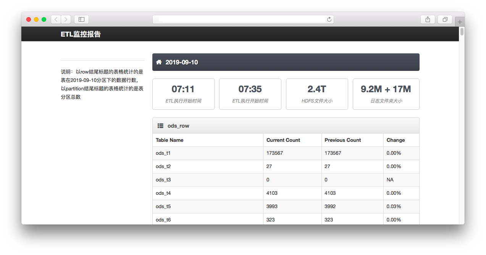

# 中文说明
## 关于
*ETL_REPORT*这个工具对ETL批量转换处理之后的数据量、HDFS占用和ETL执行时间进行统计，并通过静态页面的方式展示结果。在没有部署监控平台的项目中，可以简化每天查询检查的工作量。

这个工具主要基于Python编写，代码在3.5版本下运行测试。另外也用了Bash shell脚本来统计ETL日志中的数据，同时shell脚本也用作整个工程的调度执行。

最重展示结果的静态页面，是通过Jinja2这个Python框架来讲各个统计数据放到html中的。因为它支持判断和循环，简化了静态页面生成的工作量。

## 工程结构
```shell
|____connection.cfg     # 配置文件，包括执行路径，Hive连接信息，web容器地址等
|____result             # 最终生成的报告文件的地址
|____requirements.txt   # python包地址要求
|____run_all.sh         # 调用整体工程的shell
|____template           # 静态页面模板目录
| |____index2.html      # 静态页面模板文件
|____get_execute_info.sh # 获取ETL执行信息的shell
|____report_generator.py # 静态页面生成脚本
|____etl_data_partition_checker.py # Hive表的分区数量查询
|____etl_data_count_checker.py     # Hive表的行数统计
```

## 配置参数
整个工具都通过`connection.cfg`文件统一配置，具体的参数信息如下。
```shell
[hive]
host = 192.168.1.5
port = 10000
user = hdfs
[path]
work=/somewhere/etl_report/
output=/somewhere/etl_report/result/
template=/somewhere/etl_report/template/
usage_csv=/somewhere/etl_report/result/time_disk_usage.csv
hdfs_dir=/etl
[shellonly]
kettle_log=/somewhere/kettle/logs/
shell_log=/somewhere/shell/logs/
python_bin=/somewhere/anaconda3/bin/
[check_object]
databases=ods,dw
[web_container]
web_user=hadoop
web_server=192.168.1.7
web_dir=/var/www/etl/
```
* 其中`hive`这一段存放Hive连接信息
*  `path`这一段存放输入输出文件存放的路径
*  `shellonly`这一段存放日志和执行文件路径，shell文件调用时使用
*  `check_object`中存放需要检查的Hive数据库，数据库之间使用英文逗号分隔
*  `web_container`中存放远程web容器的信息

## 执行
使用bash命令调用`run_all.sh`脚本即可，支持输入日期参数，格式为yyyyMMdd。若执行时不加参数，则默认为执行当日。
```shell
bash run_all.sh 20191020
```

如果要周期行执行监控，可以使用crontab调用`run_all.sh`
```shell
29 03 * * * /somewhere/etl_report/run_all.sh > /somewhere/etl_report/result/execute.log 2>&1
```

## 监控截图

以下为监控报告使用浏览器打开的效果。注意，具体的效果需要结合css配置。
